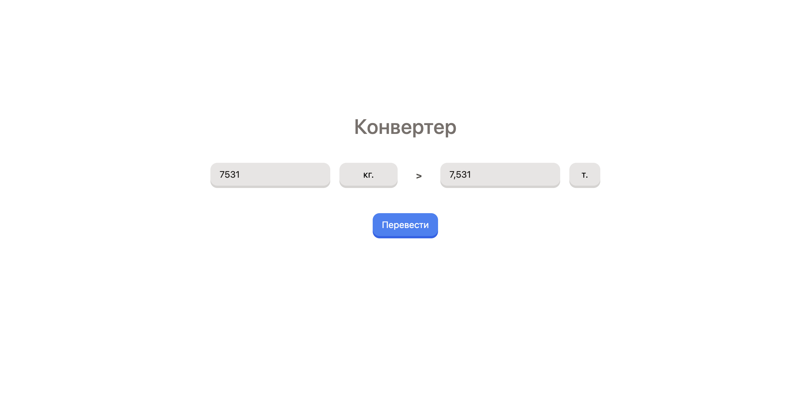

# About
Small project to convert different values as example for teach my friend


# Project prepare
```sh
npm install
npm run prepare
```

# Project setup
## dev
```sh
npm run dev
```
and visit http://localhost:3000

## release preview
```sh
npm run preview
```
and visit http://localhost:3000

## release static build
```sh
npm run build
```
and see `./.output/public` dir
